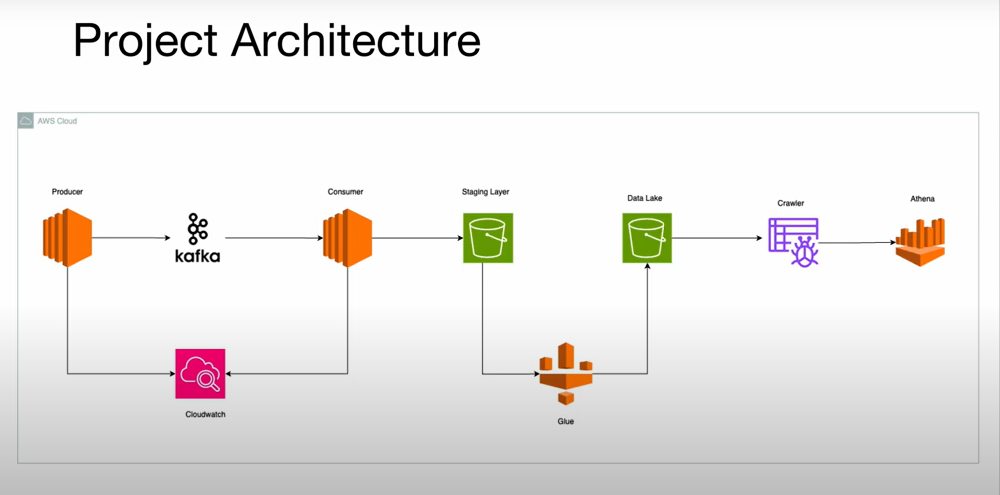

# Spotify End-to-End Data Pipeline using AWS & Kafka (Redpanda)

## 📌 Project Overview
This project demonstrates building an **end-to-end data engineering pipeline** using AWS services and Kafka (via **Redpanda Cloud**). The goal is to ingest Spotify dataset files, stream them through Kafka, process them with consumers, store them in AWS S3, transform them using AWS Glue, and finally query them with AWS Athena for analysis and visualization in Power BI.


---

## 🏗️ Architecture


1. **Producer Application** (Python, running on AWS EC2)  
   - Reads data from Spotify CSVs (Tracks, Albums, Artists).  
   - Publishes records into Kafka topics hosted on **Redpanda Cloud**.  

2. **Kafka Cluster (Redpanda)**  
   - Managed Kafka cluster with per-request pricing.  
   - Topics created for each dataset: `albums`, `artists`, and `tracks`.  

3. **Consumer Application** (Python, on EC2)  
   - Reads messages from Kafka topics.  
   - Writes data into **Staging Layer (Raw Zone)** in S3.  

4. **AWS Glue ETL Jobs**  
   - Transforms raw data and loads it into **Data Lake (Processed Zone)** in S3.  
   - Joins Tracks, Albums, and Artists into a single unified dataset.  
   - Stores data in **Parquet format** for efficient querying.  

5. **AWS Glue Crawler**  
   - Crawls Data Lake to infer schema and create tables in Glue Data Catalog.  

6. **AWS Athena**  
   - Queries transformed data directly from S3.  
   - Provides SQL-based access for analytics and integration with Power BI.  

7. **Power BI**  
   - Connects to Athena for visualization and reporting.  

8. **Monitoring**  
   - All events tracked via **AWS CloudWatch**.  

---

## 📂 Dataset
Source: [Spotify Dataset (Kaggle)](https://www.kaggle.com/datasets/tonygordonjr/spotify-dataset-2023)  

- **Files Used:**  
  - `albums.csv`  
  - `artists.csv`  
  - `tracks.csv`  

- Data is cleaned and pre-processed before being ingested into Kafka.  

---

## ⚙️ Project Setup

### 1. Kafka Cluster (Redpanda Cloud)
- Created a managed Kafka cluster on [Redpanda Cloud](https://cloud.redpanda.com/).  
- Configured topics: `albums`, `artists`, `tracks`.  
- Tested producer → consumer workflow locally before deploying to AWS.  

### 2. Producer & Consumer Apps (Python)
- Implemented in **VS Code** using `kafka-python`, `pandas`, and `boto3`.  
- **Producer**: Publishes records from CSV → Kafka topic.  
- **Consumer**: Consumes messages → writes to S3 (Staging).  

### 3. AWS EC2 Setup
- Launched EC2 instance (`t3.micro`, Amazon Linux).  
- Configured **SSH key pair** and **IAM Role** with S3 access.  
- Installed dependencies:
  ```bash
  sudo yum update
  sudo yum install python3-pip -y
  pip install pandas kafka-python boto3```
  
- Transferred local producer/consumer code via `scp`.
- Ran apps to stream data to Kafka and load into S3.

### 4. AWS S3 Buckets

- **Staging Layer (Raw Data)** – receives data directly from consumers.
- **Data Lake (Processed Data)** – stores transformed parquet files.

### 5. AWS Glue ETL

- Built Glue Visual ETL jobs to:

  - Merge Tracks, Artists, Albums.
  - Remove duplicate/unnecessary columns.
  - Partition data by ingestion date.
  - Save as Parquet in Data Lake.

### 6. AWS Glue Crawler

- Crawled Data Lake.
- Created database and tables in Glue Data Catalog.

### 7. AWS Athena

- Queried data lake tables with SQL.
- Verified schema correctness and data quality.

### 8. Power BI Integration

- Connected Power BI to Athena using ODBC.
- Fixed **access denied error** by:

  - Creating dedicated S3 Athena query results folder (`athena-query-results/`).
  - Updating IAM permissions for Athena.
  - Re-configuring ODBC DSN in Power BI.

---

## 🛠️ Tech Stack

- **Streaming**: Apache Kafka (Redpanda Cloud)
- **Compute**: AWS EC2
- **Storage**: AWS S3 (Staging + Data Lake)
- **ETL**: AWS Glue (Jobs + Crawlers)
- **Query Engine**: AWS Athena
- **Monitoring**: AWS CloudWatch
- **Visualization**: Power BI

---

## ✅ Key Learnings

- How to set up and use **Kafka topics & partitions** with Redpanda.
- Best practices for **producer-consumer applications** with AWS EC2.
- Designing a **multi-zone data lake (Raw + Processed)** in S3.
- Automating transformations with **Glue ETL** and schema discovery with **Glue Crawlers**.
- Optimizing queries using **Athena + Parquet**.
- Troubleshooting and configuring **Power BI → Athena ODBC integration**.

---

## 📊 Example Queries (Athena)

```sql
-- Count tracks by artist
SELECT artist_name, COUNT(*) AS track_count
FROM spotify_tracks
GROUP BY artist_name
ORDER BY track_count DESC
LIMIT 10;

-- Average popularity by album
SELECT album_name, AVG(track_popularity) AS avg_popularity
FROM spotify_tracks
GROUP BY album_name
ORDER BY avg_popularity DESC
LIMIT 10;
```

